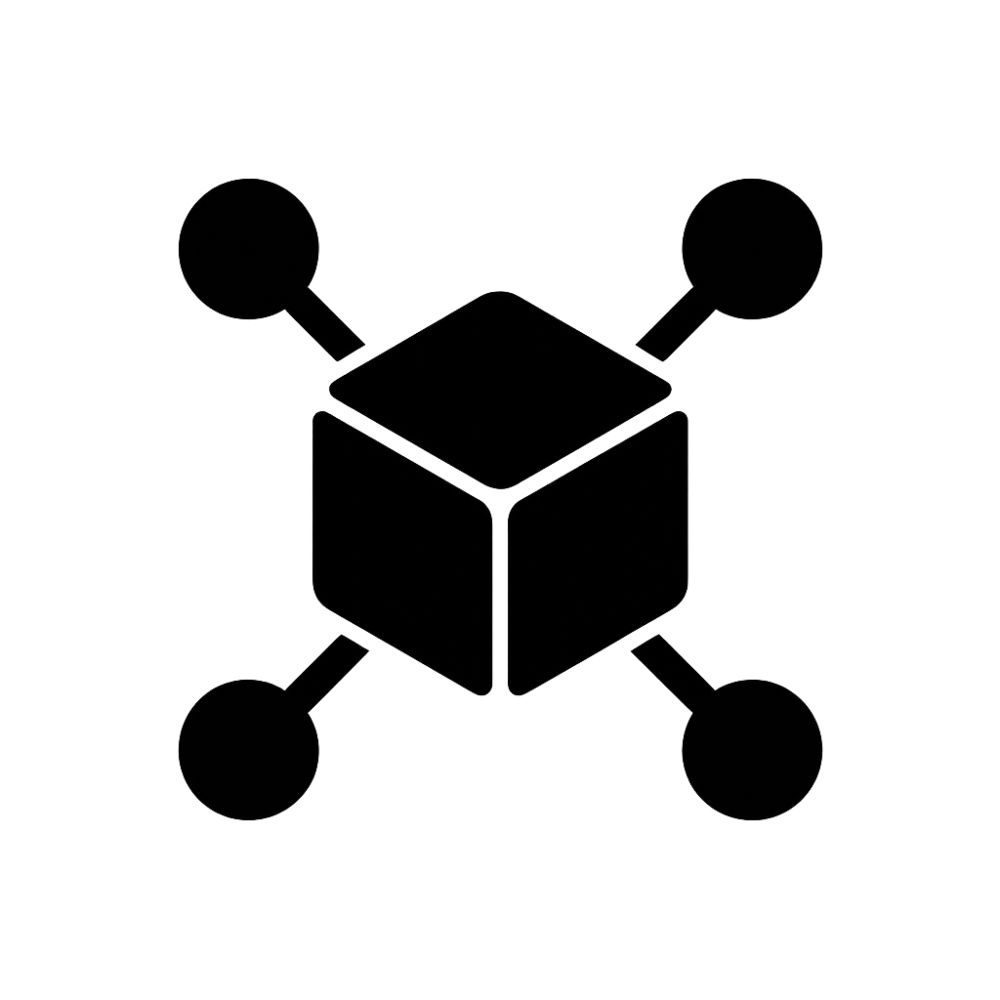
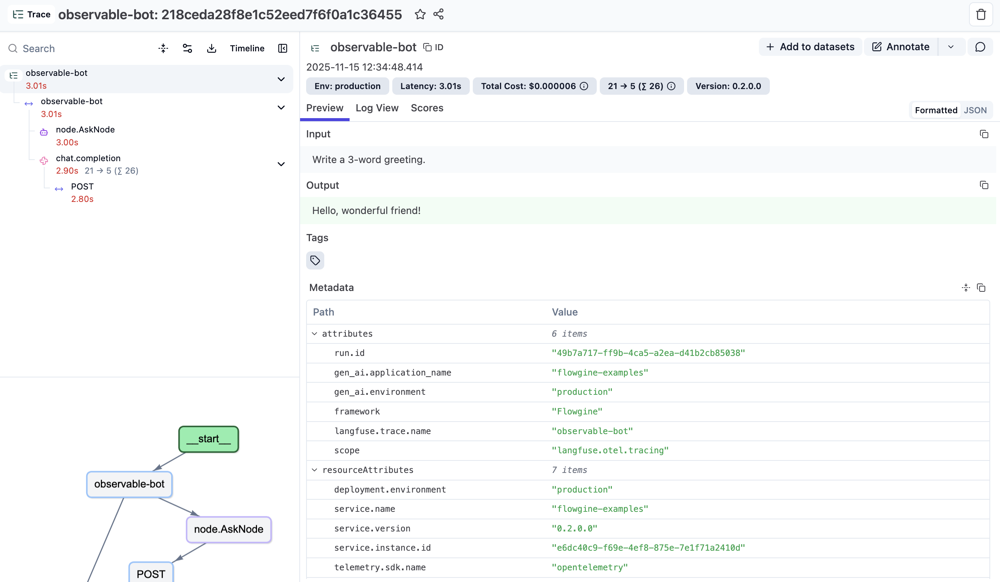

<p align="center">
  
</p>

<h1 align="center">Flowgine.NET</h1>

<p align="center"><em>The missing .NET library for building AI agents.</em></p>

### What is Flowgine.NET?

Flowgine.NET is an open-source, graph-based workflow engine for building AI agents in .NET inspired by **LangGraph**. 

It gives you low-level, strongly-typed primitives to orchestrate **complex control flows** all expressed in C#. Flowgine.NET is built for production from day one, with observability (traces, logs, metrics) and **evaluation as first-class** features so you can inspect every step your agents take, debug misbehavior, and continuously improve performance.

Before using Flowgine.NET, we recommend you be comfortable with the core ingredients of an agent — especially language models and tools — since Flowgine.NET focuses on how these pieces work together rather than defining them for you.

### System Requirements
- **.NET**: .NET 8.0+ 
- **OS Support**: Windows, macOS, Linux

### How do I get started?
1. Install the core engine. This package gives you the graph workflow engine, state management, and basic building blocks for agent orchestration.
```bash
dotnet add package Flowgine
```
2. Flowgine keeps orchestration separate from model providers. To work with LLMs, you’ll usually want:
```bash
dotnet add package Flowgine.LLM
dotnet add package Flowgine.LLM.OpenAI
```
3. Observability is a first-class citizen in Flowgine. To capture traces, metrics, and logs for your agent workflows, add:
```bash
dotnet add package Flowgine.Observability
```
4. If you want ready-made integration with **Langfuse** for LLM observability, add:
```bash
dotnet add package Flowgine.Observability.Langfuse
```
#### Configuration
Create an appsettings.json file in your project root (or extend the existing one) and add the OpenAI and Langfuse sections:
``` json
{
  "OpenAI": {
    "ApiKey": "sk-...",          // Your OpenAI / compatible API key
    "DefaultModel": "gpt-5-mini" // Default model Flowgine will use
  },
  "Langfuse": {
    "PublicKey": "pk-lf-...",                     // Can be empty if you rely on env vars
    "SecretKey": "sk-lf-...",                     // Can be empty if you rely on env vars
    "Host": "https://cloud.langfuse.com"         // Or e.g. "https://us.cloud.langfuse.com"
  }
}
```
This keeps your API key out of source code and lets you override values per environment (for example via appsettings.Development.json or environment variables like OpenAI__ApiKey).

Register OpenAI and Langfuse:
```csharp
services.AddOpenAI(builder.Configuration.GetSection("OpenAI"));
services.AddLangfuseObservability(
    publicKey,
    secretKey,
    applicationName: "flowgine-examples",
    langfuseHost: host,
    configure: o =>
    {
        o.EnableConsoleExporter = true; // Enable for debugging
    });
```

### Example
```csharp
using Flowgine.Core;
using Flowgine.Observability;

// Resolve the observability provider from the DI container.
var observabilityProvider = Program.Services.GetService<IObservabilityProvider>();

// Create a new Flowgine graph with AgentState as the state type
// that flows through the nodes.
var flowGraph = new Flowgine<AgentState>();

// Add a single node of type AskNode to the graph.
var ask = flowGraph.AddNode(new AskNode());

// Use the same node as both the entry and finish point of the graph.
// This means the flow starts and ends at `ask` (a simple single-node graph).
flowGraph.SetEntryPoint(ask)
    .SetFinishPoint(ask);

// Compile the graph into an executable flow instance with a friendly name.
// After compilation, the structure is fixed and ready to be run.        
var compiledFlow = flowGraph.Compile(name:"observable-bot");

// Attach observability to the compiled flow.
// When observabilityProvider is configured (e.g., Langfuse), the flow
// will emit traces, spans, metrics, etc. for each run.
var flow = compiledFlow.WithObservability(observabilityProvider);

// Prepare the initial agent state. This is the input that will be passed
// into the flow on the first run.
var state = new AgentState
{
    Prompt = "Write a 3-word greeting."
};

// Generate a unique identifier for this particular run.
var runId = Guid.NewGuid();

// Use RunToCompletionAsync for simpler usage; alternatively you can
// subscribe to events to react to each node execution step.
var final = await flow.RunToCompletionAsync(state, Program.Services!, runId, ct);
```

AskNode

```csharp
public class AskNode : AsyncNode<AgentState>, IObservableNode
{
    // Used by the observability layer to categorize this node's events.
    // For example, you can distinguish between "agent", "tool", "retriever", etc.
    public string ObservationType => "agent";

    public override async ValueTask<object?> InvokeAsync(
          AgentState state, Runtime runtime, CancellationToken ct = default)
    {
        // Resolve the OpenAI provider from the runtime (DI-like container).
        // This gives access to the configured LLM instance.
        var openAIProvider = runtime.Get<IOpenAIProvider>();
        var llm = openAIProvider.GetModel();

        // Try to resolve the observability provider (e.g., Langfuse).
        // If available, wrap the LLM so that all LLM calls are traced / logged.
        var obsProvider = runtime.Get<IObservabilityProvider>();
        if (obsProvider != null)
            llm = llm.WithObservability(obsProvider);
        
        // Build a simple chat request:
        // - A system message to keep the model concise
        // - A user message coming from the AgentState.Prompt
        var req = new ChatRequest([
            ChatMessage.System("Be concise."),
            ChatMessage.User(state.Prompt)
        ]);

        // Call the LLM asynchronously and get a completion.
        var completion = await llm.GenerateAsync(req, ct);

        // Extract the text content from the first message part.
        // Fallback to an empty string if the cast fails or there is no text.
        var text = (completion.Message.Parts[0] as TextContent)?.Text ?? "";

        // Return a state update that sets AgentState.LastAnswer to the model output.
        // Flowgine will merge this partial update back into the state.
        return Update.Of<AgentState>()
            .Set(x => x.LastAnswer, text);
    }
}
```

### Langfuse Observability


